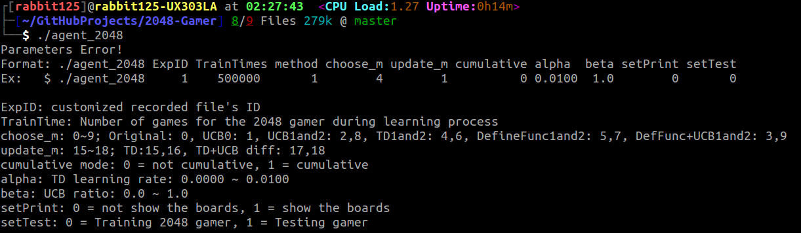
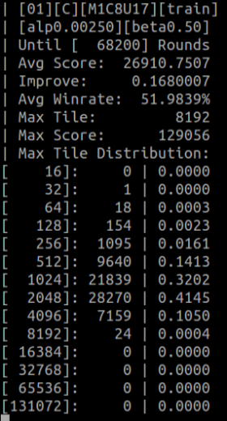
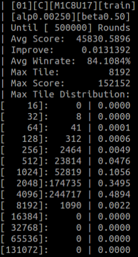

# 2048-Gamer

## Setup
```
$ git clone https://github.com/jays6215/2048-Gamer.git
$ cd 2048-Gamer
```
## How to train a gamer
* Compile the srcs
```
$ make
```
* Setting parameters
```
$ ./agent_2048 # with training parameters
```


* Training and waiting

  -->  

## How to test your gamer
* Start to test the gamer

## Used Method
* TD-AFTERSTATE
* TD-AFTERSTATE + UCB chooser

## Some Evaluation

 - For each combination, 30 independent experiments were conducted.

 - In each experiment, 500,000 games were played for training, and another 1000 games were played for testing.

| Method \ alpha  | 0.001 | 0.0025 | 0.005 | 0.0075 | 0.0100 | 
| :-------------: |:---------------:|:---------------:|:---------------:|:---------------:|:---------------:|
| TD-AFTERSTATE   | 50923.60±235.06 | 52253.80±204.30 | 49248.82±222.90 | 44234.60±172.68 | 42560.08±191.11 |
| UCB beta = 0.25 | 48781.89±285.29 | 51342.00±195.24 | 50453.38±682.96 | 47851.24±221.09 | 42738.41±191.45 |
| UCB beta = 0.50 | 48755.53±202.99 | **54125.00±172.95** | 45810.46±253.50 | 46008.62±251.14 | 38524.31±175.99 | 
| UCB beta = 0.75 | 49193.01±316.83 | 52917.00±263.35 | 47314.33±220.79 | 46252.70±248.69 | 43171.76±226.60 |
| UCB beta = 1.00 | 48271.51±250.24 | 52111.80±191.97 | 48784.50±219.27 | 44406.12±201.64 | 43913.85±181.46 |

 - The gamer with the best setting above got winning rate(Max tile ≥ 2048): **93.917%±0.274** 

 - The average scores of 1000 testing games after 500,000 training games, with 95% confidence intervals.
